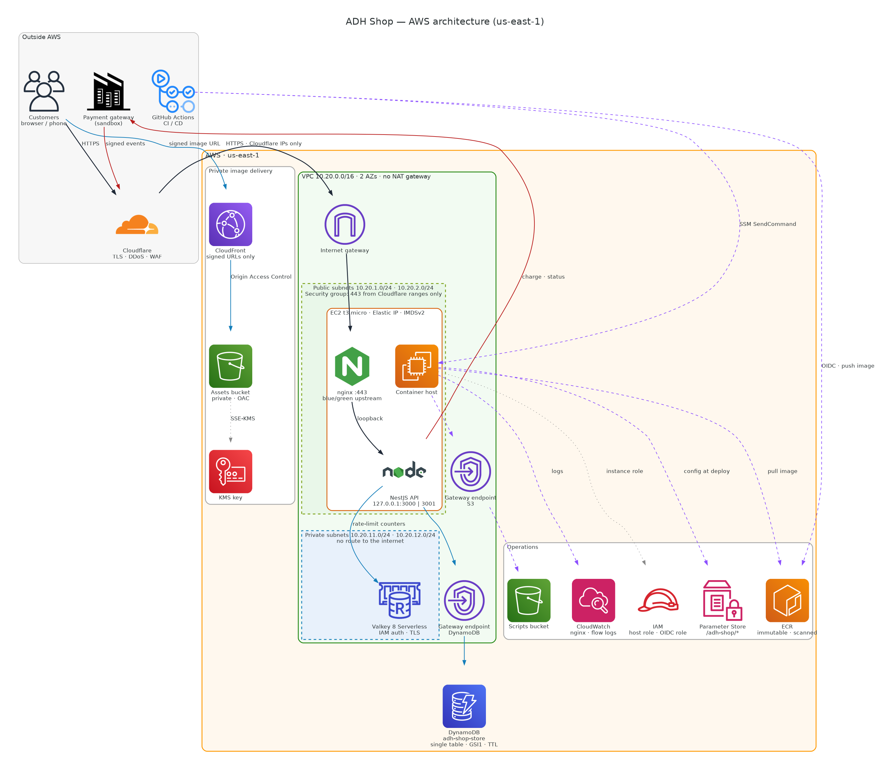
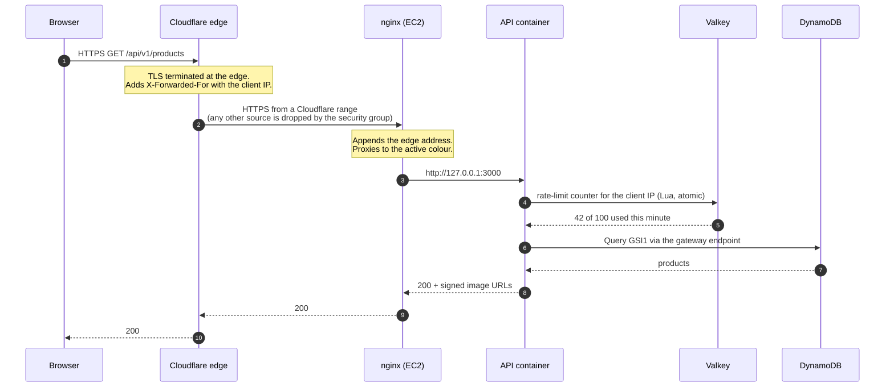
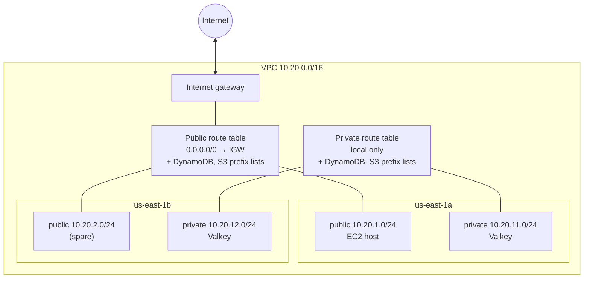
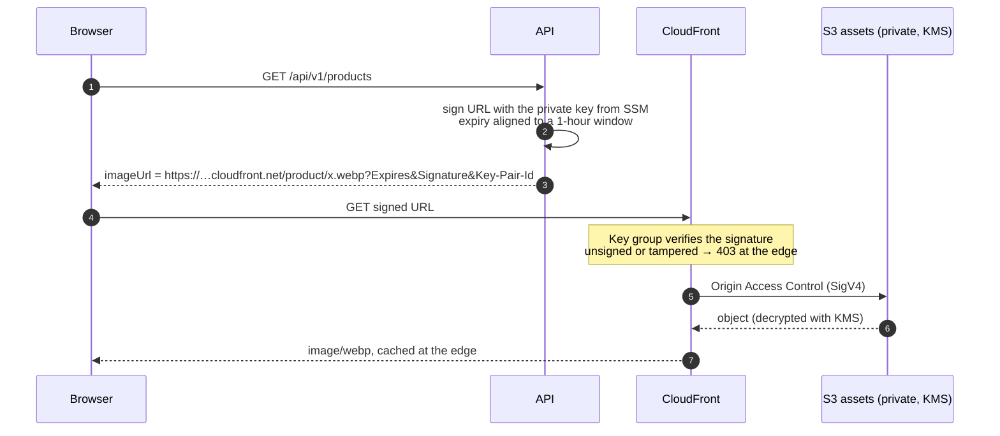
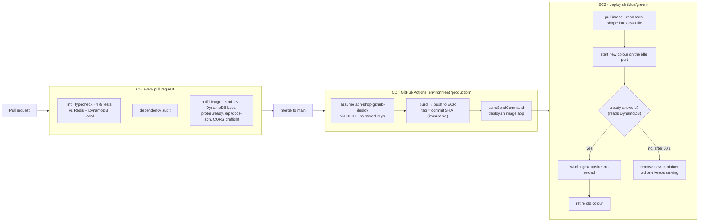

# ADH Shop — Infrastructure

Terraform for the ADH Shop platform on AWS: the network, the host running the API, the
data store, the rate-limit cache, the private image CDN, the container registry, the
configuration store and the identity GitHub deploys with. One environment, one region
(`us-east-1`), one `terraform apply`.

The API it runs lives in [adh-shop-api](https://github.com/alfredo0607/adh-shop-api), served
at `https://adh-api.alfredo-dominguez.dev`.

---

## Contents

1. [Architecture at a glance](#architecture-at-a-glance)
2. [How a request travels](#how-a-request-travels)
3. [Components](#components)
4. [Network](#network)
5. [The edge: Cloudflare in front of the origin](#the-edge-cloudflare-in-front-of-the-origin)
6. [Private image delivery](#private-image-delivery)
7. [Deployment pipeline](#deployment-pipeline)
8. [Configuration and secrets](#configuration-and-secrets)
9. [Security controls](#security-controls)
10. [Observability](#observability)
11. [Repository layout](#repository-layout)
12. [First run](#first-run)
13. [Operational runbook](#operational-runbook)
14. [Cost](#cost)
15. [Decisions and trade-offs](#decisions-and-trade-offs)

---

## Architecture at a glance



| Line | Meaning |
| --- | --- |
| Solid black | Customer traffic: browser → Cloudflare → origin → nginx → API |
| Solid blue | Data: DynamoDB through its gateway endpoint, the rate-limit cache, signed image delivery |
| Solid red | Payment gateway: charges and status out, signed events back in through Cloudflare |
| Dashed purple | Deployment and operations: OIDC, image push and pull, SSM commands, configuration, logs |
| Dotted grey | Identity and encryption relationships |

The diagram is generated from code, in [`docs/diagrams/architecture.py`](docs/diagrams/architecture.py),
with the official AWS icons. Its header explains how to regenerate it.

**In one paragraph.** Customers reach the API through Cloudflare. Cloudflare forwards to
nginx on an EC2 instance in a public subnet, and nginx proxies to the API container on
the loopback interface. The instance accepts HTTPS **only from Cloudflare's IP ranges**,
so nobody can reach it around the edge. The API keeps its data in DynamoDB, reached
privately through a VPC gateway endpoint, and its rate-limit counters in an ElastiCache
Valkey cache that has no route to the internet at all. Product images sit in a private S3
bucket behind CloudFront, served only through URLs the API signs. GitHub Actions deploys
without any stored AWS key: it assumes a role through OIDC, pushes the image to ECR, and
tells the host through SSM to run a blue/green switch.

## How a request travels



The API trusts exactly **two proxy hops** when reading the client address: Cloudflare and
nginx. That is only safe because the origin cannot be reached without passing through
Cloudflare first. See [The edge](#the-edge-cloudflare-in-front-of-the-origin).

## Components

| Component | AWS resource | Configuration | Why it is there |
| --- | --- | --- | --- |
| Network | VPC, 2 public + 2 private subnets over 2 AZs, internet gateway | `10.20.0.0/16` | Isolates the tiers; private subnets have no internet route |
| Private AWS access | VPC gateway endpoints for DynamoDB and S3 | Free | Data and script traffic never crosses the internet, and no NAT gateway is needed |
| API host | EC2 `t3.micro`, Amazon Linux 2023, Elastic IP | gp3 20 GB encrypted, IMDSv2 required | Runs nginx and the API containers |
| Reverse proxy | nginx + certbot on the host | Upstream per app, blue/green ports | TLS to the origin, one place to switch versions |
| Firewall | Security group | 443 from Cloudflare's 15 IPv4 ranges; 80 for certificate renewal; 22 per `allowed_ssh_cidrs`; egress DNS/HTTP/HTTPS + cache only | The host is reachable only the intended way |
| Data store | DynamoDB `adh-shop-store` | On-demand, single table, `GSI1` (projection ALL), TTL on `expiresAt`, encrypted | Products, customers, transactions, deliveries, idempotency keys |
| Rate-limit cache | ElastiCache Serverless, Valkey 8 | Private subnets, IAM auth, TLS, capped at 1 GB and 5,000 ECPU/s | Shared counters so the limit holds across containers |
| Container registry | ECR `adh-shop-api` | Immutable tags, scan on push, keeps 10 images, drops untagged after 1 day | Every release is an image tagged with its commit SHA |
| Image storage | S3 assets bucket | Private, versioned, SSE-KMS with a dedicated key | Product images |
| Image CDN | CloudFront + Origin Access Control + key group | `PriceClass_100`, HTTPS only, security headers policy (HSTS, `nosniff`, `DENY` framing) | Serves images only through signed, expiring URLs |
| Configuration | SSM Parameter Store `/adh-shop/*` | `String` and `SecureString` | Single source of configuration and secrets |
| Operational scripts | S3 scripts bucket | Private, versioned, encrypted | `deploy.sh`, `add-api.sh`, `add-keys.sh`, fetched by the host |
| Host identity | IAM role + instance profile | Scoped to this table, `/adh-shop/*` parameters, this registry, this cache user | What the containers can touch, and nothing more |
| Deploy identity | IAM role trusted through GitHub OIDC | Only the `production` environment of this repository | Deploys without long-lived AWS keys |
| Logs | CloudWatch log groups | nginx access/error, bootstrap, VPC flow logs (rejects, 30 days) | Incident investigation |
| Terraform state | S3 bucket (bootstrap stack) | Versioned, KMS-encrypted, native S3 locking | Shared, locked state |

## Network



| Tier | Contents | Route to the internet | Why |
| --- | --- | --- | --- |
| Public | The container host | Yes, through the internet gateway | It must be reachable by Cloudflare and by Let's Encrypt |
| Private | The Valkey cache | **None** | Stronger than any security group rule: even a misconfigured group cannot expose it |

**There is no NAT gateway.** A NAT costs roughly 32 USD a month and is only needed when
something in the private tier must reach the internet. Nothing does. DynamoDB and S3 are
reached through gateway endpoints, which are free and keep that traffic on AWS's network.

The cache spans two AZs because ElastiCache Serverless requires subnets in at least two.
The host runs in one: a single instance is a deliberate trade for this environment (see
[Decisions](#decisions-and-trade-offs)).

## The edge: Cloudflare in front of the origin

DNS for `adh-api.alfredo-dominguez.dev` is **proxied** by Cloudflare (orange cloud).
Clients connect to Cloudflare, which connects to the origin's Elastic IP.

The security group accepts port 443 **only from Cloudflare's published IPv4 ranges**, one
rule per range. Terraform fetches them from `https://www.cloudflare.com/ips-v4` on every
plan, so a range Cloudflare adds is picked up by the next apply. The plan fails if the
list cannot be fetched or looks incomplete, so a partial list, which would take the site
offline, is never applied.

Why this matters: the API reads the client address through two trusted proxies to rate
limit per client. Before this restriction, a caller could connect straight to the origin
and put any address in `X-Forwarded-For`, getting a fresh rate-limit bucket on every
request and skipping Cloudflare's DDoS protection entirely. That was reproduced against
production and is closed. Direct connections to the origin now time out.

> [!WARNING]
> **The Cloudflare proxy must stay enabled** on the API's DNS record. With "DNS only"
> (grey cloud), visitors would connect from their own addresses and be refused by the
> security group.

Port 80 stays open for certbot's HTTP-01 renewal and only redirects to HTTPS. Replacing
the Let's Encrypt certificate with a Cloudflare Origin CA certificate would allow closing
it.

## Private image delivery



Two independent controls, and both must pass:

- **Origin Access Control** is the only way into the bucket. The bucket policy allows
  `s3:GetObject` to CloudFront, conditioned on this distribution's ARN. The KMS key policy
  lets CloudFront decrypt under the same condition.
- **`trusted_key_groups`** on the distribution rejects any request without a valid
  signature at the edge, before the origin is touched.

Signed URLs expire at the end of an aligned hour window, so everyone gets the same URL for
an hour. Browsers and CloudFront can cache the image instead of treating every response as
a new URL.

### The signing key never passes through Terraform

RSA 2048, which is what CloudFront requires. Generated once, outside Terraform:

```bash
openssl genrsa -out private.pem 2048
openssl rsa -pubout -in private.pem -out public_key.pem
aws s3 cp private.pem s3://<scripts bucket>/keys/cloudfront/private.pem
rm private.pem
```

Only the public half is read by Terraform, from `public_key.pem` in the stack directory. A
public key is not a secret, so it is committed, with a `.gitignore` exception written as a
full path rather than a filename, because `!public_key.pem` on its own would let a private
key slip through under that name.

The private half travels S3 → Parameter Store → deleted. `add-keys.sh` pulls it into a
directory created with mode 700, writes it as a `SecureString`, and a trap shreds and
removes that directory on any exit. Generating it in Terraform would be fewer steps, but
the key would then live in state: a file read on every plan, by anyone who can run one.

CloudFront trusts a *key group* rather than a key. That indirection makes rotation
possible without downtime: add a second key, let clients migrate, then remove the first.

## Deployment pipeline



- **No AWS keys in GitHub.** The deploy role trusts GitHub's OIDC provider, and only
  tokens for this repository's `production` environment. The trust policy matches the
  immutable numeric owner and repository ids, not their names, so a renamed or
  re-registered repository cannot inherit it. Which branch may deploy is enforced by
  GitHub on the environment.
- **The deploy role can do three things**: push to this ECR repository, send
  `AWS-RunShellScript` to this one instance, and read the result.
- **Blue/green with a readiness gate.** The new container must answer `/ready`, which
  performs a real DynamoDB read, before traffic moves. A release that cannot reach its data
  is never switched to. Existing connections drain on `nginx reload`, and the old container
  is removed only after traffic has moved.
- **Rollback is automatic** when the new version never becomes ready: nothing was switched.
  Rolling back a bad release that *did* pass is re-running the deploy with the previous
  image SHA; tags are immutable, so that image is exactly what ran before.

## Configuration and secrets

Parameter Store is the single source of truth. Values the infrastructure knows (table
name, cache endpoint, CDN domain, key pair id, trusted proxy hops, allowed CORS origin) are
**written by Terraform**, so nobody copies them by hand. Secrets are published separately
with `add-keys.sh` and **never pass through Terraform state**.

| Parameter | Type | Written by |
| --- | --- | --- |
| `DYNAMODB_TABLE_NAME`, `AWS_REGION` | String | Terraform |
| `REDIS_HOST`, `REDIS_PORT`, `REDIS_TLS`, `REDIS_USERNAME`, `REDIS_CACHE_NAME` | String | Terraform |
| `CDN_DOMAIN`, `CDN_KEY_PAIR_ID` | String | Terraform |
| `TRUST_PROXY_HOPS` (= 2), `CORS_ALLOWED_ORIGINS` | String | Terraform |
| `PAYMENT_API_URL` | String | `add-keys.sh` |
| `PAYMENT_PUBLIC_KEY`, `PAYMENT_PRIVATE_KEY`, `PAYMENT_INTEGRITY_SECRET`, `PAYMENT_EVENTS_SECRET` | SecureString | `add-keys.sh` |
| `CDN_PRIVATE_KEY` | SecureString | `add-keys.sh` |

At deploy time, `deploy.sh` reads `/adh-shop/*` into a file created with `umask 077` and
removed by a trap, so the values exist on disk only for the seconds Docker needs to read
them. Multi-line values, such as the PEM key, are published to the container
base64-encoded as `<NAME>_BASE64`. The instance role can read only `/adh-shop/*`.

The cache has **no password anywhere**. The host signs a short-lived IAM token with its
instance role on every connection, and IAM auth requires TLS. The cache user may run read,
write and scripting commands on one key prefix, so a compromised application can touch
only the rate-limit counters.

## Security controls

| Layer | Control |
| --- | --- |
| Edge | Cloudflare proxy; origin accepts HTTPS only from Cloudflare's ranges |
| Transport | HTTPS end to end; HSTS from the API and on CloudFront responses |
| Host | IMDSv2 required, so an SSRF in the app cannot read instance credentials; encrypted root volume; application ports never in the security group, and containers bound to `127.0.0.1` |
| Network | Cache in subnets with no internet route; egress limited to DNS, HTTP(S) and the cache |
| Identity | No long-lived keys: instance role for the host, OIDC role for CI, IAM tokens for the cache |
| Least privilege | Host role: DynamoDB **data plane** only on this table (cannot create or drop tables), `/adh-shop/*` parameters, this registry, this cache user |
| Data at rest | DynamoDB, S3 (state, scripts, assets with KMS), ECR, EBS encrypted |
| Images | Private bucket, Origin Access Control, signed and expiring URLs |
| Supply chain | Immutable image tags, ECR scan on push, `pnpm audit` in CI, Trivy config scan of this repository |
| Audit | VPC flow logs of rejected traffic, 30 days; nginx logs in CloudWatch |

**SSH** is controlled by `allowed_ssh_cidrs`. It defaults to open, which is a visible,
documented choice rather than an oversight. A `/32` narrows it to one address, and an
empty list closes the port entirely, while Session Manager keeps working because it needs no
inbound rule. All operational work in this project (deploys, script sync, diagnostics) goes
through SSM rather than SSH.

## Observability

| Signal | Where |
| --- | --- |
| HTTP access and errors at the proxy | CloudWatch `/adh-shop-container-host/nginx/access` and `/nginx/error` |
| Host bootstrap | CloudWatch, bootstrap log group |
| Rejected network traffic | CloudWatch VPC flow logs, 30 days |
| Application logs | Structured JSON (pino) with a request id per request, on the container's stdout; `docker logs` on the host |
| Liveness / readiness | `/health` (process up) · `/ready` (DynamoDB readable), used by the image `HEALTHCHECK` and the deploy gate |
| Deploy history | GitHub Actions runs and SSM command history |

Shipping the container's stdout to CloudWatch (the `awslogs` Docker log driver) is the next
step if more than one host ever runs the API.

## Repository layout

```
terraform/
├── bootstrap/
│   └── remote-state/          S3 bucket holding the state of every other stack
├── infrastructures/
│   └── container-api-ec2/     The whole platform in one apply
├── modules/
│   ├── vpc/                   Subnets, route tables, gateway endpoints, flow logs
│   ├── ec2-container-host/    Instance, security group, host IAM role
│   ├── dynamodb/              The single table, GSI1, TTL
│   ├── valkey-cache/          Serverless cache, IAM user, user group
│   ├── ecr/                   Registry and lifecycle policy
│   ├── s3-private-assets/     Private, versioned, encrypted bucket
│   ├── kms/                   Customer-managed key
│   ├── cloudfront-cdn/        Distribution, OAC, key group, security headers
│   └── iam-github-oidc/       Deploy role trusted by GitHub OIDC
├── user-data/                 Instance boot script, rendered by templatefile()
└── scripts/                   deploy.sh, add-api.sh, add-keys.sh, uploaded to S3
scripts/
├── tf-init.sh                 Initialises a stack against the right state bucket
└── test-deploy-scripts.sh     Checks the operational scripts
docs/
├── architecture.png           The diagram at the top of this README
└── diagrams/architecture.py   Its source, with the official AWS icons
```

## First run

Nothing asks for an account id or a bucket name. Both are derived from whoever is
authenticated, so the state a stack writes to always belongs to the account it is
deploying into.

```bash
export AWS_PROFILE=<a profile that can create these resources>
export AWS_REGION=us-east-1

# 1. The state bucket. Local state, applied once.
terraform -chdir=terraform/bootstrap/remote-state init
terraform -chdir=terraform/bootstrap/remote-state apply

# 2. The whole platform.
./scripts/tf-init.sh terraform/infrastructures/container-api-ec2
terraform -chdir=terraform/infrastructures/container-api-ec2 apply
```

Then, once, following the stack's `next_steps` output:

1. Point the API's DNS record at the Elastic IP, **proxied** through Cloudflare.
2. Publish the secrets: `add-keys.sh <env-file>`.
3. Publish the site: `add-api.sh <subdomain> 3000 <email>`, which creates the nginx
   upstream and virtual host and obtains the certificate.
4. Deploy. From then on, merging to `main` in adh-shop-api deploys automatically.

**Why `tf-init.sh` rather than a backend file.** A `backend` block cannot use variables, so
the usual `backend.hcl` means either committing the account id to a public repository or
retyping it. The script derives the bucket from `sts get-caller-identity`, which also rules
out initialising against another account's state. Locking is native to S3
(`use_lockfile = true`, Terraform 1.10+).

## Operational runbook

| Task | How |
| --- | --- |
| Change infrastructure | Pull request → CI (`fmt`, `validate`, `tflint`, Trivy, ShellCheck) → merge → `terraform plan -out` → review → `apply` |
| Update an operational script | Merge, `apply` (uploads to S3), then sync on the host: `aws s3 sync s3://<scripts bucket>/scripts/ /opt/adh-shop/` through SSM |
| Redeploy an image | `sudo -u ec2-user /opt/adh-shop/deploy.sh <ecr-uri>:<sha> adh-api` through SSM |
| Roll back | The same, with the previous SHA |
| Rotate a secret | `aws ssm put-parameter --overwrite …`, then redeploy so the container reads it |
| Inspect the host | Session Manager; no SSH key needed |
| Cloudflare adds IP ranges | Nothing to edit: the next `plan` fetches the new list |

## Cost

Approximate monthly cost in `us-east-1` for this environment at demo traffic. Confirm in
the billing console.

| Item | Approx. USD / month | Note |
| --- | ---: | --- |
| EC2 `t3.micro` | 7.60 | Free-tier eligible during an account's first year |
| Public IPv4 (Elastic IP) | 3.60 | AWS charges for every public IPv4 address |
| ElastiCache Serverless (Valkey) | 6–7 | Minimum billed storage even when idle |
| KMS customer-managed key | 1.00 | Assets bucket |
| DynamoDB on-demand, S3, ECR, CloudFront, CloudWatch | < 2 | Pay per use; mostly within free tiers at this volume |
| NAT gateway | 0 | Deliberately absent (~32 would apply otherwise) |
| **Total** | **≈ 20** | |

## Decisions and trade-offs

**One stack rather than four.** Network, data, registry, host, CDN and cache were once
separate stacks. That separation earns its keep when different teams own layers that
change at different rates. Here one person owns everything in one short-lived environment,
so it bought ceremony rather than safety, at the price of four applies in a fixed order.
The image CDN in particular belongs with the API: CloudFront verifies signatures the API
produces, so the key pair, the key group and the parameter the API reads have to be
created together.

**A single EC2 host rather than ECS or an auto scaling group.** Cheapest option that still
gives zero-downtime deploys (blue/green on one host) and automatic rollback. The cost is
that one instance is a single point of failure: an AZ outage takes the API down until it
is recreated. The application is already stateless, since state lives in DynamoDB and
Valkey. Moving to ECS on Fargate behind a load balancer across two AZs would change the
host module and the deploy step, not the application.

**Cloudflare in front rather than an ALB.** TLS, DDoS protection and caching at no cost,
with the origin locked to Cloudflare's ranges. An ALB would add about 16 USD a month and
would still need the same origin lock-down to prevent bypass.

**Valkey Serverless rather than a node.** No capacity to size, TLS and IAM auth built in,
and usage caps that turn a runaway key space into throttling instead of an unbounded bill.
Valkey is cheaper than Redis OSS on ElastiCache.

**Gateway endpoints rather than a NAT gateway.** The only AWS services the private tier and
the host need privately are DynamoDB and S3, which gateway endpoints cover for free.
